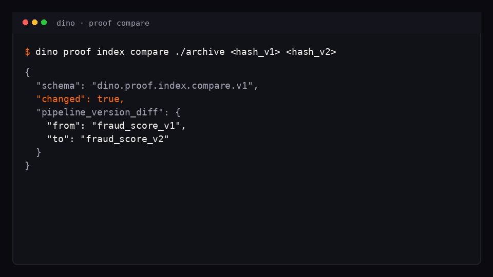
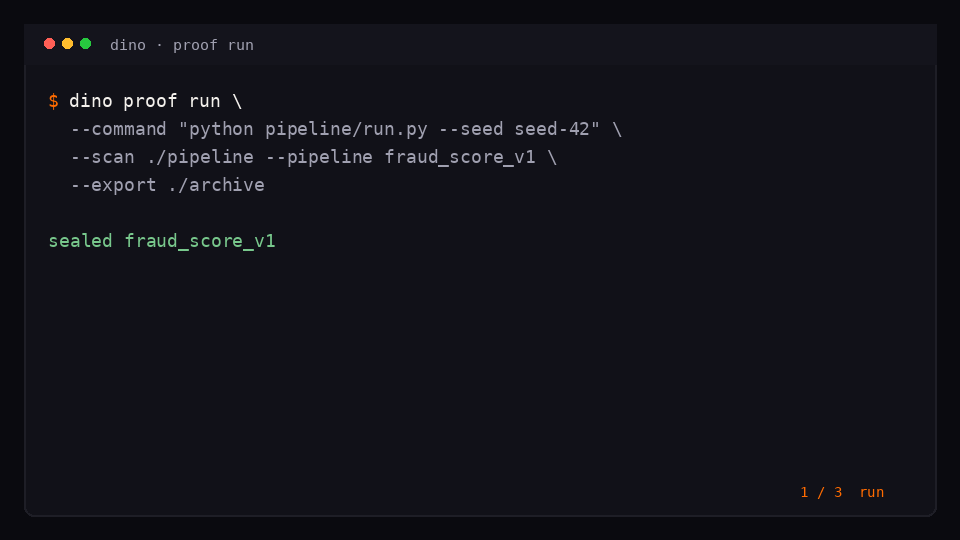

# Dino

[](https://github.com/DinoDevCli/dino/actions/workflows/ci.yml)
[](LICENSE)
[](pyproject.toml)
[](https://codespaces.new/DinoDevCli/dino)
[](https://github.com/DinoDevCli/dino/releases/tag/v0.3.2)

**Local-first audit engine for Python pipelines.**

Pipeline drift kept breaking our fraud-scoring runs. Same code, same data, same environment — different outputs. Dino seals each run into a content-addressed proof bundle, exports it (Path / HTTP / S3), and answers one question:

> **Did this run actually change?**



<p align="center">
  
</p>

```text
$ dino proof index compare ./archive <hash_v1> <hash_v2>

{
  "schema": "dino.proof.index.compare.v1",
  "changed": true,
  "pipeline_version_diff": {
    "from": "fraud_score_v1",
    "to": "fraud_score_v2"
  },
  "drift_delta": { "from": "none", "to": "none" },
  "verdict_diff": {
    "from": "PROOF_PARTIAL",
    "to": "PROOF_PARTIAL"
  }
}
```

*(CLI excerpt from [`tests/simulation/golden`](tests/simulation/golden) — fraud_score v1 vs v2. Capture plan: [`docs/internal/SCREENSHOT_PLAN.md`](docs/internal/SCREENSHOT_PLAN.md).)*

---

## Install

```bash
pip install "git+https://github.com/DinoDevCli/dino.git@v0.3.2"
dino proof run --help
```

> Not on PyPI as `dino` / `dino-cli` (name collision). Install from GitHub only.

**No local setup?** [Open in GitHub Codespaces](https://codespaces.new/DinoDevCli/dino) → `cd tests/simulation && make demo`

---

## Why this exists

Two pipeline runs that should have been identical weren’t.  
Logs, snapshots, artifact diffs — none were deterministic.

Dino is the smallest local engine that seals a run and diffs it machine-readably.

---

## What Dino produces

| Artifact | Role |
|----------|------|
| **Proof bundles** | Sealed, content-addressed `proof.json` (capsule + scan + hash) |
| **Proof index** | Stable `proof_index.json` for dashboards |
| **Compare** | Structural diff — `changed: true/false` |
| **Envelopes** | Export Path / HTTP / S3 (`dino.proof.export.v1`) |

Everything is **local-first**. No cloud product. No hosted dashboard. You bring Superset / Airflow / MLflow.

All proof bundles and indexes are **deterministic and reproducible** (content-addressed).

---

## Quick demo

```bash
# Seal run A
dino proof run \
  --command "python pipeline/run.py --seed seed-42" \
  --scan ./pipeline \
  --pipeline fraud_score_v1 \
  --export ./archive

# Seal run B
dino proof run \
  --command "python pipeline/run.py --seed seed-123" \
  --scan ./pipeline \
  --pipeline fraud_score_v2 \
  --export ./archive

# Diff
dino proof index compare ./archive <hash_v1> <hash_v2>
```

Reproduce the website walkthrough:

```bash
cd tests/simulation && make demo
```

Golden excerpts: [`tests/simulation/golden/demo_excerpts.json`](tests/simulation/golden/demo_excerpts.json)

---

## Example: proof bundle

Minimal shape (`dino.proof.bundle.v1`) — from the fraud-score simulation:

```json
{
  "schema": "dino.proof.bundle.v1",
  "status": "partial",
  "audit": {
    "verdict": "PROOF_PARTIAL",
    "summary": "Capsule sealed; one or more optional parts were skipped.",
    "reasons": ["capsule_sealed", "scan_clean", "map_skipped"]
  },
  "parts": {
    "capsule_replay_ok": true,
    "scan_ok": true,
    "drift_bucket": "aligned"
  }
}
```

Normative contract: [`docs/PROOF_CONTRACT.md`](docs/PROOF_CONTRACT.md)

---

## Example: compare

```bash
dino proof index compare ./archive <hash_v1> <hash_v2>
```

```json
{
  "changed": true,
  "pipeline_version_diff": {
    "from": "fraud_score_v1",
    "to": "fraud_score_v2"
  },
  "schema": "dino.proof.index.compare.v1"
}
```

Exit **1** when `changed` — CI-friendly.

---

## Starter kit

Not a Dino UI — a mapping you drop into **your** Superset:

- [`examples/superset/drift_dashboard.yaml`](examples/superset/drift_dashboard.yaml)
- [`docs/INTEGRATION_DASHBOARDS.md`](docs/INTEGRATION_DASHBOARDS.md)

---

## CLI (v0.3.2)

| Command | Role |
|---------|------|
| `dino scan leakage` | Free forever — causal leakage scan |
| `dino proof run` | Seal pipeline + optional scan → proof + export |
| `dino proof index compare` | Diff two proofs |
| `dino proof index metrics` | Health summary JSON |
| `dino proof doctor` | Proof-stack health |
| `dino --dev …` | Developer Mode — relax `EMPTY_SCAN_ROOTS` only |
| `dino --help` | Lists Optional features (Proof Pack) — documentary |

Full reference: [`docs/CLI_E2E_REFERENCE.md`](docs/CLI_E2E_REFERENCE.md) · Help tour: [`docs/cli-help-tour.txt`](docs/cli-help-tour.txt) · Docs: [`docs/index.md`](docs/index.md)

---

## Design goals

- deterministic  
- minimal  
- reproducible  
- local-first  
- no orchestration  
- no hosted dashboards  
- no cloud dependencies  

---

## Early Access

**Open Early Access** — any team can request a key. 60-day Proof Pack. No limited seats.

For team usage (CI compare gate, envelope backends, engine contract stability), email [dinodevcli@gmail.com](mailto:dinodevcli@gmail.com) with team name / size + use case · [Open an issue](https://github.com/DinoDevCli/dino/issues/new?title=Early%20Access%20Request)

```bash
dino upgrade --pack proof --key YOUR_TEAM_KEY
dino proof doctor
```

Leakage scan stays free forever. Engine only — dashboards are external.

### Pricing & Licensing

MIT core. Proof Pack license after Early Access — one-time purchase per seat or team. **No subscriptions. No cloud fees.**  
[`docs/LICENSING.md`](docs/LICENSING.md)

---

## Contributing

Issues and discussions welcome.

| Track | Link |
|-------|------|
| Engine / `--dev` | [#1](https://github.com/DinoDevCli/dino/issues/1) |
| Superset starter | [#2](https://github.com/DinoDevCli/dino/issues/2) |
| Proof contract v2 | [#3](https://github.com/DinoDevCli/dino/issues/3) |
| Integration examples | [#4](https://github.com/DinoDevCli/dino/issues/4) |
| Runners roadmap | [#5](https://github.com/DinoDevCli/dino/issues/5) |
| README CLI capture | [#9](https://github.com/DinoDevCli/dino/issues/9) |
| FAQ “Did this run change?” | [#10](https://github.com/DinoDevCli/dino/issues/10) |
| Metabase starter | [#11](https://github.com/DinoDevCli/dino/issues/11) |
| CI compare gate | [#12](https://github.com/DinoDevCli/dino/issues/12) |
| Demo GIF | [#13](https://github.com/DinoDevCli/dino/issues/13) |
| Pricing feedback | [Discussion #6](https://github.com/DinoDevCli/dino/discussions/6) |
| `--dev` feedback | [Discussion #7](https://github.com/DinoDevCli/dino/discussions/7) |
| Dashboard patterns | [Discussion #8](https://github.com/DinoDevCli/dino/discussions/8) |

Proof format: [`docs/PROOF_CONTRACT.md`](docs/PROOF_CONTRACT.md) · Diff / index: [`docs/PROOF_INDEX.md`](docs/PROOF_INDEX.md) · Envelopes: [`docs/PROOF_EXPORT.md`](docs/PROOF_EXPORT.md)

```bash
git clone https://github.com/DinoDevCli/dino.git
cd dino && python -m venv .venv && source .venv/bin/activate
pip install -e '.[dev]'
pytest tests/dino tests/e2e -q
```

---

## License

MIT · [DinoDevCli](https://github.com/DinoDevCli) · Site: [dinodevcli.github.io/dino](https://dinodevcli.github.io/dino/)
